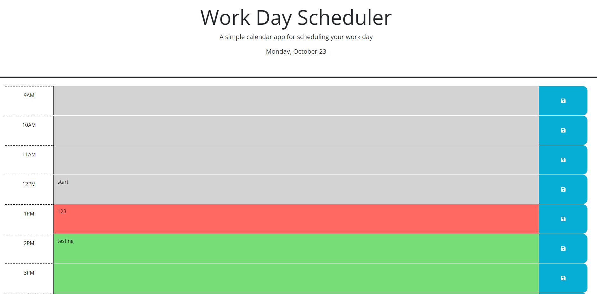

# workday-scheduler

## Description

The goal of this project is to create a simple workday planner in the browser given a starter code. The user may input and and save their to do list that corresponds with the hour of a normal work day period (9am - 5pm). This is also color coded based on what time it is currently. Green is for the future, red is for the current hour, and the gray is for the past. If the user wants to save their to do list, they can click the save button to save it to local storage where they can go back to the page to access their list again. 

## Installation

N/A

## Usage

Open the deployed project via GitHub page [here](https://jxdang1.github.io/workday-scheduler/). Once you have navigated to the page, you will type your to do list in the text areas that corresponds to the time that you need to get that done by or to start it at. Once you have typed everything that you need to do for the day, on the right hand side, you can click on the button that will save your to do list where you can come back to later on to check your list. 

Down below shows an image of an example workday schedule:

## Credits

The project was provided in our asssignments from the KU Full Stack Bootcamp. There were HTML, CSS, and JSS starter codes provided within the project.

## License

Please see licence in github repo